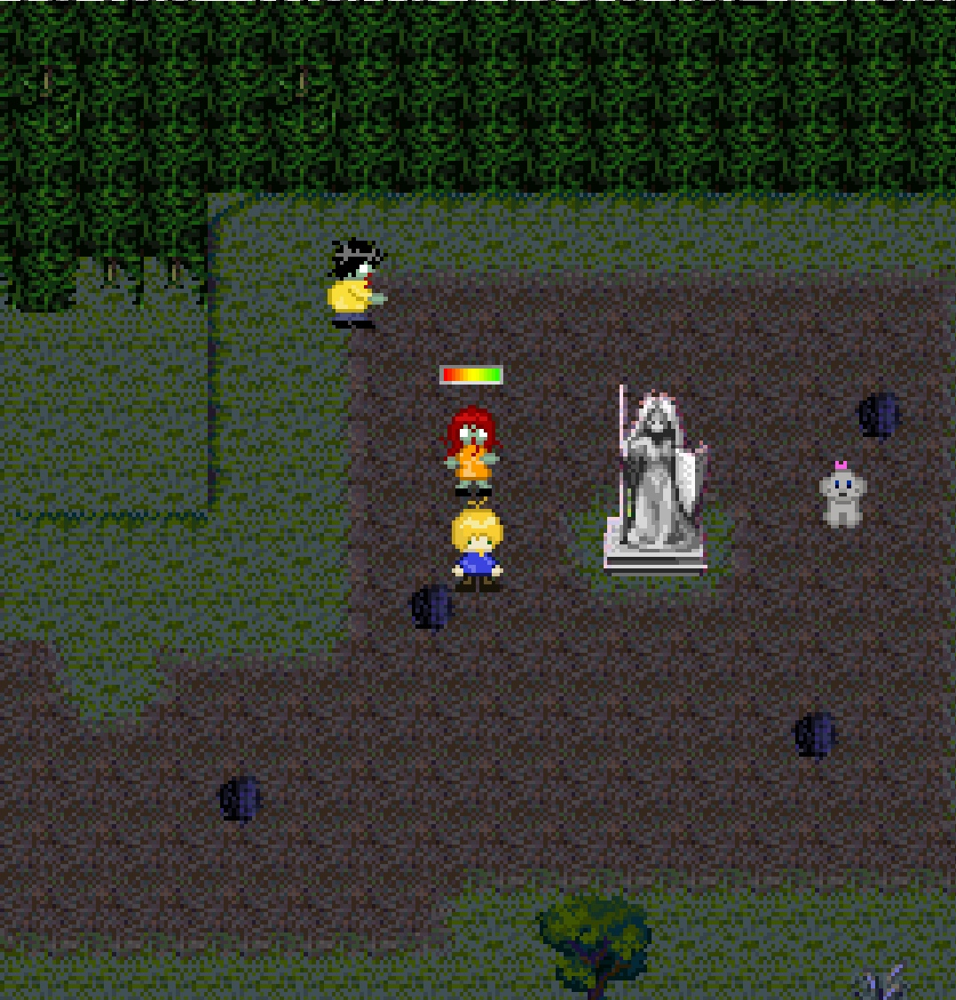

# Chaos Campus

Chaos Campus was a university project where computer science students created a J2ME mobile game for feature phones. 

You are playing a student called Simon. An evil witch has kidnapped the university president and she released a poisonous substance on the university campus to convert all students to monsters. Simon must solve riddles and engage in boss fights to rescue the president and fellow students.

The game language is german.

This is an android port of the J2ME game. It is based on [J2ME-Loader](https://github.com/nikita36078/J2ME-Loader).

## Additional information

[Download Presentation (PDF)](https://woizischke.com/chaos-campus.pdf)

Website: [woizischke.com/chaoscampus](https://woizischke.com/chaoscampus/index.html)

## License
> The J2ME Loader source code is licensed under the [Apache License, Version 2.0.](http://www.apache.org/licenses/LICENSE-2.0)  
> (See the [LICENSE](https://github.com/nikita36078/J2ME-Loader/blob/master/LICENSE) file for the whole license text.)

## Screenshots

